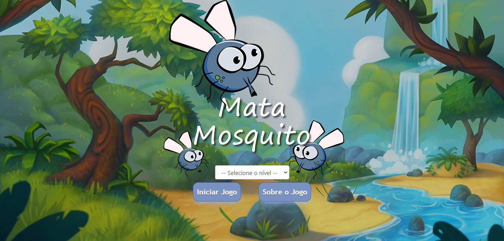

## Projeto final  Game mata Mosquito

Projeto Realizado no curso Desenvolvimento web

 
 </img>

--- 

## 📋 Índice

- [Sobre](#projeto-final-banco-de-dados)
- [Tecnologias utilizadas](#-tecnologias-utilizadas)
- [Construído com](#%EF%B8%8F-construído-com)

--- 

## 🚀 Tecnologias utilizadas

O projeto está desenvolvido utilizando as seguintes tecnologias:

- HTML
- JavaScript
- CSS

--- 

## 🛠️ Construído com

* [Visual Studio Code](https://code.visualstudio.com/) - ferramenta de desenvolvimento

--- 

## 🛠️ Projeto no ar

* [Netlify](https://game-mata-mosquito2.netlify.app/)
 
## 🎁 Expressões de gratidão

* Conte a outras pessoas sobre este projeto 📢
* Obrigado por ver esse projeto ❤️

--- 
